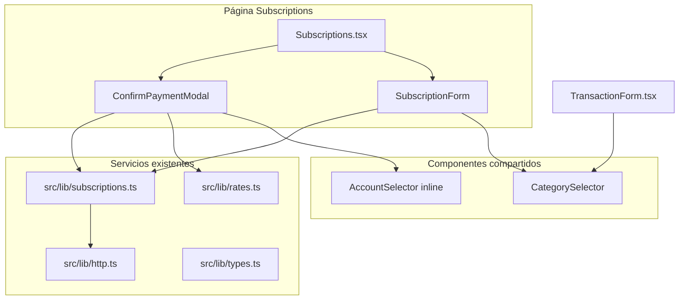
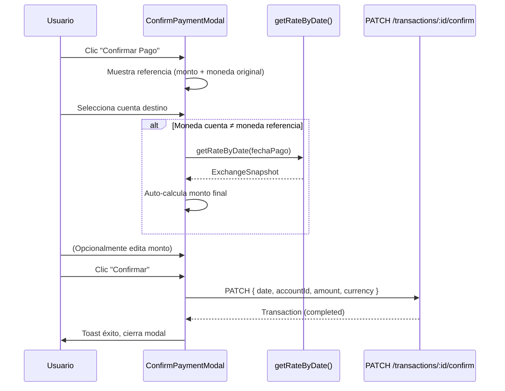

# Documento de Diseño — Refactor UX de Suscripciones

## Visión General

Este diseño cubre el refactor de la experiencia de suscripciones en Platica, organizado en tres ejes:

1. **Extracción de `CategorySelector`**: Componente reutilizable que encapsula el Dialog de selección de categorías (grid, pestañas income/expense, formulario inline de creación) actualmente embebido en `TransactionForm.tsx`.
2. **Humanización del `SubscriptionForm`**: Copy cercano al usuario, selector de modo de ejecución con radio cards, cuenta opcional, y selector de moneda de referencia (USD/EUR/VES).
3. **`ConfirmPaymentModal` inteligente**: Modal de confirmación de pago pendiente con referencia original, selector de cuenta, auto-cálculo de conversión vía `getRateByDate()` del servicio BCV existente en `src/lib/rates.ts`.

### Decisiones clave

| Decisión | Justificación |
|---|---|
| Reusar `getRateByDate` y `ExchangeSnapshot` de `src/lib/rates.ts` | Ya implementa caché local, fallback a días anteriores y retry. No duplicar. |
| `CategorySelector` controlado vía `value`/`onChange` | Compatible con `react-hook-form` via `Controller` y con estado local (`useState`). |
| `accountId` opcional en `RecurringTransactionPayload` | Permite guardar suscripciones sin cuenta asignada (se elige al confirmar). |
| Radio cards para modo de ejecución | Más claro que un Switch; cada opción muestra descripción contextual. |
| Backend `PATCH /api/transactions/:id/confirm` ya acepta `{ date, accountId, amount, currency }` | Confirmado por hotfix previo. No hay bloqueante backend. |

## Arquitectura

### Diagrama de componentes



### Flujo de confirmación de pago



## Componentes e Interfaces

### 1. CategorySelector

Archivo: `src/components/CategorySelector.tsx`

Extrae toda la lógica del selector de categorías de `TransactionForm.tsx` (líneas ~50-110 estado, ~280-500 JSX del Dialog).

```typescript
interface CategorySelectorProps {
  value: string;                          // ID de categoría seleccionada
  onChange: (categoryId: string) => void; // Callback al seleccionar
  filterType?: "income" | "expense";      // Restringe pestañas visibles
  categories: Category[];                 // Lista de categorías disponibles
  className?: string;                     // Clases adicionales para el botón trigger
}
```

**Estado interno del componente:**
- `categoryModalOpen: boolean` — controla apertura del Dialog
- `pickerType: "income" | "expense"` — pestaña activa (inicializada desde `filterType` o `"expense"`)
- `newCatName, newCatColor, newCatColorName, newCatIcon, newCatGroupId` — formulario inline de creación
- `categoryGroups: CategoryGroup[]` — cargados via `fetchCategoryGroups()` al montar
- `creatingCat: boolean` — loading de creación inline

**Comportamiento:**
- Al seleccionar una categoría del grid → invoca `onChange(cat.id)`, cierra Dialog.
- Al crear categoría inline → `CategoriesStore.upsert(...)`, invoca `onChange(newCat.id)`, cierra Dialog.
- Si `filterType` está definido, oculta `TabsList` y fija `pickerType` al valor dado.
- Dialog sigue patrón fluido: `w-[95vw] max-w-lg max-h-[85vh] overflow-y-auto`.

**Integración con react-hook-form:**
```tsx
// En SubscriptionForm (react-hook-form)
<Controller
  name="categoryId"
  control={control}
  render={({ field }) => (
    <CategorySelector
      value={field.value}
      onChange={field.onChange}
      filterType="expense"
      categories={categories}
    />
  )}
/>

// En TransactionForm (useState)
<CategorySelector
  value={category}
  onChange={setCategory}
  categories={categories}
/>
```

### 2. SubscriptionForm (refactorizado)

Se refactoriza el formulario dentro del Dialog de creación en `Subscriptions.tsx`.

**Cambios de copy:**
| Antes | Después |
|---|---|
| "Modo de ejecución" | "¿Cómo pagas esto?" |
| Switch Auto/Manual | Radio cards con descripciones |
| Cuenta (obligatoria) | Cuenta (opcional) con hint |
| Sin selector de moneda | Selector "Moneda de referencia" (USD/EUR/VES) |

**Radio cards para modo de ejecución:**
```tsx
<RadioGroup value={mode} onValueChange={setMode} className="grid grid-cols-1 gap-3 sm:grid-cols-2">
  <label className={cn("cursor-pointer rounded-lg border p-4", mode === "auto" && "border-primary ring-2 ring-primary/30")}>
    <RadioGroupItem value="auto" className="sr-only" />
    <p className="font-medium">Automático</p>
    <p className="text-xs text-muted-foreground">
      Platica lo registrará solo cada mes (ideal para débitos automáticos).
    </p>
  </label>
  <label className={cn("cursor-pointer rounded-lg border p-4", mode === "manual" && "border-primary ring-2 ring-primary/30")}>
    <RadioGroupItem value="manual" className="sr-only" />
    <p className="font-medium">Recordatorio</p>
    <p className="text-xs text-muted-foreground">
      Platica te avisará para que confirmes la fecha, el monto y de qué cuenta lo pagaste.
    </p>
  </label>
</RadioGroup>
```

**Selector de moneda de referencia:**
```tsx
<Select value={currency} onValueChange={setCurrency}>
  <SelectTrigger><SelectValue placeholder="Moneda" /></SelectTrigger>
  <SelectContent>
    <SelectItem value="USD">USD ($)</SelectItem>
    <SelectItem value="EUR">EUR (€)</SelectItem>
    <SelectItem value="VES">VES (Bs.)</SelectItem>
  </SelectContent>
</Select>
```

**Cuenta opcional:** El campo `accountId` se presenta con placeholder "Sin cuenta asignada (opcional)" y se envía como `undefined` si no se selecciona.

### 3. ConfirmPaymentModal

Archivo: `src/components/ConfirmPaymentModal.tsx`

```typescript
interface ConfirmPaymentModalProps {
  open: boolean;
  onOpenChange: (open: boolean) => void;
  pendingTx: Transaction | null;
  referenceCurrency: "USD" | "EUR" | "VES"; // Moneda original de la suscripción
  referenceAmount: number;                   // Monto original de la suscripción
  accounts: Account[];
  onConfirmed: () => void;                   // Callback post-confirmación exitosa
}
```

**Estado interno:**
- `selectedAccountId: string` — cuenta seleccionada
- `finalAmount: string` — monto final editable (string para input numérico)
- `finalCurrency: "USD" | "EUR" | "VES"` — moneda final (derivada de la cuenta seleccionada)
- `paymentDate: string` — fecha de pago (YYYY-MM-DD, default hoy)
- `loadingRate: boolean` — indicador de carga de tasa BCV
- `submitting: boolean` — loading de confirmación

**Flujo de auto-cálculo:**
1. Usuario selecciona cuenta → se determina `finalCurrency` de `account.currency`.
2. Si `finalCurrency !== referenceCurrency`:
   - Se invoca `getRateByDate(paymentDate)` (de `src/lib/rates.ts`).
   - Se calcula `finalAmount`:
     - Si cuenta VES y referencia USD: `snap.vesPerUsd × referenceAmount`
     - Si cuenta VES y referencia EUR: `snap.vesPerEur × referenceAmount`
     - Otros cruces: se convierte a USD primero, luego a moneda destino.
   - Se auto-rellena el campo de monto.
3. Si `finalCurrency === referenceCurrency`: `finalAmount = referenceAmount`.
4. El usuario puede editar manualmente el monto auto-calculado.
5. Si `getRateByDate` falla → toast de error, campo vacío para entrada manual.
6. Si el usuario cambia `paymentDate` después de un auto-cálculo → se re-ejecuta el flujo.

**Validación:** No se puede confirmar sin `selectedAccountId`. Se muestra mensaje inline "Selecciona una cuenta para continuar".

**Dialog fluido:** `w-[95vw] max-w-md max-h-[85vh] overflow-y-auto`.

**Payload de confirmación:**
```typescript
confirmPendingTransaction(pendingTx.id, {
  date: paymentDate,
  accountId: Number(selectedAccountId),
  amount: Number(finalAmount),
  currency: finalCurrency,
});
```

## Modelos de Datos

### Extensiones de tipos en `src/lib/types.ts`

```typescript
// RecurringTransaction — agregar campo currency
export interface RecurringTransaction {
  id: string;
  amount: number;
  description: string;
  frequency: string;
  next_date: string;
  execution_mode: RecurringExecutionMode;
  is_active: boolean;
  categoryId: string;
  accountId: string;
  currency: "USD" | "EUR" | "VES"; // NUEVO — default "USD"
}

// RecurringTransactionPayload — agregar currency, accountId opcional
export interface RecurringTransactionPayload {
  amount: number;
  description: string;
  frequency: string;
  next_date: string;
  execution_mode: RecurringExecutionMode;
  is_active: boolean;
  categoryId: number;
  accountId?: number;                      // CAMBIADO a opcional
  currency: "USD" | "EUR" | "VES";        // NUEVO
}

// ConfirmPendingTransactionPayload — extender con campos reales
export interface ConfirmPendingTransactionPayload {
  date: string;
  accountId: number;                       // NUEVO — obligatorio
  amount: number;                          // NUEVO — obligatorio
  currency: "USD" | "EUR" | "VES";        // NUEVO — obligatorio
}
```

### Cambios en `src/lib/subscriptions.ts`

La función `mapRecurringTransaction` debe mapear el campo `currency`:

```typescript
function mapRecurringTransaction(item: ApiRecurringTransaction): RecurringTransaction {
  return {
    // ... campos existentes ...
    currency: (item as any).currency || "USD", // fallback "USD"
  };
}
```

El tipo `ApiRecurringTransaction` se extiende con `currency?: string`.

### Propagación de moneda a transacciones pendientes

Las transacciones pendientes generadas por suscripciones ya incluyen `currency` en el campo `Transaction.currency` (mapeado por `mapServerTransaction`). El `ConfirmPaymentModal` recibe `referenceCurrency` y `referenceAmount` como props desde la página `Subscriptions.tsx`, que los obtiene cruzando la transacción pendiente con la suscripción recurrente asociada (por `description` match o campo futuro de relación).

Si `Transaction.currency` no está presente, se usa `"USD"` como fallback (Requisito 7.3).


## Propiedades de Correctitud

*Una propiedad es una característica o comportamiento que debe cumplirse en todas las ejecuciones válidas de un sistema — esencialmente, una declaración formal sobre lo que el sistema debe hacer. Las propiedades sirven como puente entre especificaciones legibles por humanos y garantías de correctitud verificables por máquina.*

### Propiedad 1: CategorySelector invoca onChange con el ID correcto

*Para cualquier* lista de categorías y cualquier categoría seleccionada del grid, el callback `onChange` debe ser invocado con el `id` exacto de esa categoría.

**Valida: Requisitos 1.2**

### Propiedad 2: filterType restringe las categorías visibles

*Para cualquier* lista de categorías con tipos mixtos (income/expense) y cualquier valor de `filterType` ("income" | "expense"), las categorías visibles en el picker deben ser exactamente aquellas cuyo `type` coincide con `filterType`. Si `filterType` es `undefined`, todas las categorías (excluyendo ajustes de balance) deben ser visibles.

**Valida: Requisitos 1.3**

### Propiedad 3: El payload de suscripción incluye la moneda seleccionada

*Para cualquier* estado válido del formulario de suscripción con una moneda de referencia seleccionada (USD, EUR o VES), el payload enviado a `createRecurringTransaction` debe incluir un campo `currency` cuyo valor sea exactamente la moneda seleccionada por el usuario.

**Valida: Requisitos 2.6, 2.7**

### Propiedad 4: Suscripción permite accountId opcional

*Para cualquier* estado válido del formulario de suscripción donde no se ha seleccionado cuenta, el formulario debe permitir el envío exitoso y el payload resultante debe tener `accountId` como `undefined` o ausente.

**Valida: Requisitos 2.4**

### Propiedad 5: mapRecurringTransaction aplica fallback de moneda

*Para cualquier* objeto de respuesta de la API de suscripciones recurrentes, `mapRecurringTransaction` debe producir un `RecurringTransaction` con un campo `currency` válido ("USD", "EUR" o "VES"). Si el objeto de entrada no tiene campo `currency`, el resultado debe tener `currency === "USD"`.

**Valida: Requisitos 3.1, 3.4**

### Propiedad 6: Formato de monto con moneda

*Para cualquier* monto numérico finito y cualquier moneda válida ("USD", "EUR", "VES"), la función de formateo debe producir un string que contenga tanto el monto formateado como el identificador de moneda (e.g., "37.00 EUR", "150.00 USD").

**Valida: Requisitos 4.1, 7.1**

### Propiedad 7: Conversión de moneda con tasa BCV

*Para cualquier* monto de referencia positivo, cualquier moneda de referencia (USD o EUR), y cualquier `ExchangeSnapshot` con tasas positivas finitas, cuando la cuenta destino es VES, el monto final calculado debe ser igual a `tasa_correspondiente × monto_referencia` (donde `tasa_correspondiente` es `vesPerUsd` para USD o `vesPerEur` para EUR). Cuando la moneda de referencia coincide con la moneda de la cuenta, el monto final debe ser igual al monto de referencia.

**Valida: Requisitos 5.1, 5.2, 5.3**

### Propiedad 8: confirmPendingTransaction envía payload completo

*Para cualquier* payload de confirmación válido con `date`, `accountId`, `amount` y `currency`, la función `confirmPendingTransaction` debe enviar un request `PATCH` cuyo body JSON contenga exactamente esos cuatro campos con los valores proporcionados.

**Valida: Requisitos 6.1, 6.2**

## Manejo de Errores

| Escenario | Comportamiento |
|---|---|
| `getRateByDate` falla (red, API caída) | Toast destructivo con mensaje de error. Campo de monto final queda vacío para entrada manual. (Req 5.6) |
| Usuario intenta confirmar sin cuenta seleccionada | Mensaje de validación inline: "Selecciona una cuenta para continuar". Botón de confirmar deshabilitado. (Req 4.6) |
| `CategoriesStore.upsert` falla al crear categoría inline | Toast destructivo. Dialog permanece abierto. Estado `creatingCat` vuelve a `false`. |
| `createRecurringTransaction` falla | Toast destructivo con `error.message`. Dialog permanece abierto para reintentar. |
| `confirmPendingTransaction` falla | Toast destructivo. Modal permanece abierto para reintentar. |
| Transacción pendiente sin campo `currency` | Se usa `"USD"` como fallback para la referencia. (Req 7.3) |
| API de suscripciones devuelve objeto sin `currency` | `mapRecurringTransaction` usa `"USD"` como fallback. (Req 3.4) |

## Estrategia de Testing

### Enfoque dual

Se utilizan tanto tests unitarios como tests basados en propiedades (property-based testing) para cobertura completa:

- **Tests unitarios**: Ejemplos específicos, edge cases, validaciones de UI, integración de componentes.
- **Tests de propiedades**: Propiedades universales que deben cumplirse para todas las entradas válidas.

### Librería de property-based testing

Se usará **fast-check** (`fc`) como librería de PBT para TypeScript/JavaScript. Cada test de propiedad debe ejecutar mínimo 100 iteraciones.

### Configuración de tags

Cada test de propiedad debe incluir un comentario de referencia al documento de diseño:

```typescript
// Feature: subscriptions-ux-refactor, Property 1: CategorySelector invoca onChange con el ID correcto
```

### Tests de propiedades (8 propiedades)

| Propiedad | Generadores | Aserción |
|---|---|---|
| P1: onChange con ID correcto | `fc.record({ id: fc.uuid(), name: fc.string(), type: fc.constantFrom("income","expense") })` | `onChange` recibe el `id` de la categoría clickeada |
| P2: filterType filtra categorías | Lista de categorías con tipos mixtos + `fc.constantFrom("income","expense",undefined)` | Categorías visibles coinciden con filtro |
| P3: Payload incluye currency | `fc.constantFrom("USD","EUR","VES")` + form data válida | `payload.currency === currencySeleccionada` |
| P4: accountId opcional | Form data sin accountId | Payload no tiene `accountId` o es `undefined` |
| P5: mapRecurringTransaction fallback | Objetos API con/sin campo `currency` | `result.currency` siempre es "USD", "EUR" o "VES"; sin input → "USD" |
| P6: Formato monto+moneda | `fc.float({ min: 0, noNaN: true })` + `fc.constantFrom("USD","EUR","VES")` | String resultado contiene monto y moneda |
| P7: Conversión con tasa BCV | `fc.float({ min: 0.01 })` para monto + `ExchangeSnapshot` con tasas positivas | `resultado === tasa × monto` (con tolerancia de redondeo) |
| P8: Payload de confirmación completo | `fc.record({ date, accountId, amount, currency })` | Body del PATCH contiene los 4 campos |

### Tests unitarios (ejemplos y edge cases)

- Render de SubscriptionForm muestra "¿Cómo pagas esto?" (Req 2.1)
- Seleccionar "Automático" muestra descripción de Platica (Req 2.2)
- Seleccionar "Recordatorio" muestra descripción de Platica (Req 2.3)
- Selector de moneda muestra USD, EUR, VES (Req 2.5)
- ConfirmPaymentModal muestra selector de cuenta (Req 4.2)
- ConfirmPaymentModal pre-rellena fecha actual (Req 4.4)
- Confirmar sin cuenta muestra validación (Req 4.6) — edge case
- Fallo de tasa BCV deja campo vacío (Req 5.6) — edge case
- Transacción sin currency usa "USD" (Req 7.3) — edge case
- Cambio de fecha re-calcula monto (Req 5.7)
- Monto auto-calculado es editable (Req 5.5)
- Loading indicator durante carga de tasa (Req 5.4)

### Cada propiedad de correctitud DEBE ser implementada por UN SOLO test de propiedad

No se deben dividir las propiedades en múltiples tests. Cada propiedad del documento de diseño corresponde a exactamente un `it`/`test` con `fc.assert(fc.property(...))`.
